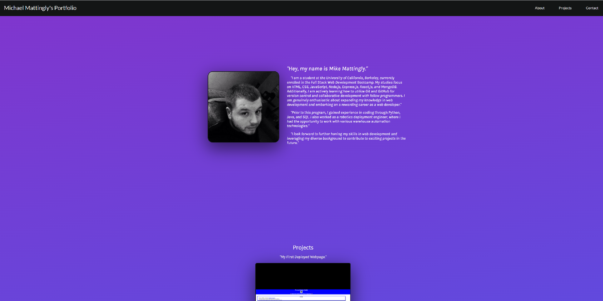

# Web Portfolio

## Technology Used

| Technology Used |                                                  Resource URL                                                  |
| --------------- | :-------------------------------------------------------------------------------------------------------------: |
| HTML            |       [https://developer.mozilla.org/en-US/docs/Web/HTML](https://developer.mozilla.org/en-US/docs/Web/HTML)       |
| CSS             |        [https://developer.mozilla.org/en-US/docs/Web/CSS](https://developer.mozilla.org/en-US/docs/Web/CSS)        |
| JavaScript      | [https://developer.mozilla.org/en-US/docs/Web/JavaScript](https://developer.mozilla.org/en-US/docs/Web/JavaScript) |
| Git             |                                    [https://git-scm.com/](https://git-scm.com/)                                    |


## Description

[Visit the Deployed Site](https://meanbean87.github.io/web-portfolio/)

This is a web portfolio created by Michael Mattingly-[Github](https://github.com/meanbean87) to showcase their skills, projects, and provide information about themselves. The portfolio is designed with a modern and visually appealing interface, utilizing HTML, CSS, and JavaScript.

## Demo



## Features

- **Responsive Design**: The portfolio is fully responsive and optimized for various screen sizes, ensuring a seamless browsing experience across devices.
- **Interactive Navigation**: The navigation bar allows users to easily navigate between different sections of the portfolio.
- **About Me**: The About Me section provides a brief introduction to the individual, along with a profile picture and a description of their background and interests.
- **Projects**: The Projects section highlights the individual's notable projects, including descriptions, images, and links to deployed pages.
- **Contact Information**: The Contact Me section provides contact details, allowing visitors to get in touch with the individual easily.

[](https://developer.mozilla.org/en-US/docs/Web/HTML) [](https://developer.mozilla.org/en-US/docs/Web/CSS) [](https://developer.mozilla.org/en-US/docs/Web/JavaScript)
## Usage

To view the web portfolio, simply visit [https://meanbean87.github.io/web-portfolio/](https://meanbean87.github.io/web-portfolio/) in your web browser. From there, you can navigate through the different sections using the navigation bar.

## Development

If you are interested in exploring the development of this web portfolio or want to contribute, follow these steps:

1. Clone the repository: `git clone https://github.com/meanbean87/web-portfolio.git`
2. Navigate to the project directory: `cd web-portfolio`
3. Open the `index.html` file in your preferred web browser to view the website locally.
4. Make changes to the HTML, CSS, or JavaScript files as desired.
5. Reload the web page to see the changes.
6. Feel free to fork the repository, make your modifications, and create a pull request if you wish to contribute to the project.

## Learning Points

How to address hover effects on mobile applications using media queries:

```
 /* Desktop Hover styling */
 @media (hover: hover) {
  .nav-item a:hover {
  color: #12c2e9;
  border-bottom: #12c2e9 solid 2px;
  }
 
  .hamburger:hover .bar {
  background-color: #12c2e9;
  }
 
  .icon-container:hover {
  filter: invert(0.5) sepia(1) saturate(5) hue-rotate(175deg);
  }
 }
 
 /* Mobile Active styling */
 @media (hover: none) {
  .nav-item a:active {
  color: #12c2e9;
  border-bottom: #12c2e9 solid 2px;
  }
 
  .hamburger:active .bar {
  background-color: #12c2e9;
  }
 
  .icon-container:active {
  filter: invert(0.5) sepia(1) saturate(5) hue-rotate(175deg);
  }
 }
 
```

## Author Info

This web portfolio is created and maintained by meanbean87. You can find the original repository at [https://github.com/meanbean87/web-portfolio](https://github.com/meanbean87/web-portfolio)

* [LinkedIn](https://www.linkedin.com/in/michael-mattingly-5580b1280/)
* [Github](https://github.com/MeanBean87)

## Credits

I would like to extend my heartfelt gratitude to the following contributors for their invaluable contributions to this project:

- **Kevin Powell** ([GitHub](https://github.com/kevin-powell)): Kevin provided a fantastic tutorial on dealing with hover on mobile. You can find the tutorial [here](https://www.youtube.com/watch?v=uuluAyw9AI0).

- **Miguel Z. Nunez** ([GitHub](https://github.com/miguelznunez)): Miguel created an excellent tutorial on how to create a responsive hamburger menu with HTML, CSS, and JavaScript. You can check out the tutorial [here](https://www.youtube.com/watch?v=flItyHiDm7E).

This project utilizes icons from Bootstrap and Uxwing.

- **Bootstrap Icons**: [https://icons.getbootstrap.com](https://icons.getbootstrap.com)
- **Uxwing Icons**: [https://uxwing.com/](https://uxwing.com/)

## License

This project is licensed under the [MIT License](https://github.com/meanbean87/web-portfolio/blob/main/LICENSE). Please refer to the LICENSE file for more details.

---
